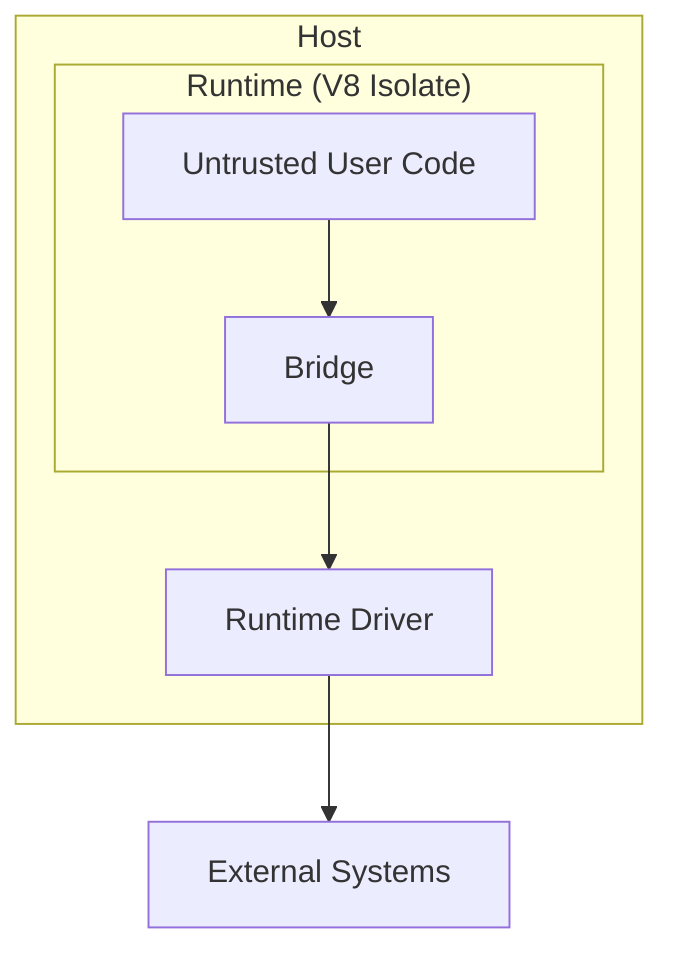

`secure-exec` runs untrusted code in isolate-based sandboxes — the same core pattern used by **modern browsers and Cloudflare Workers**. Host access is blocked by default and only available through explicitly configured capabilities.

## Runtime Guarantees

When you run untrusted code through `secure-exec`, the runtime enforces:

- **Isolate containment** — code runs inside an isolate with no direct access to host APIs.
- **Capability gating** — filesystem, network, process spawn, and environment access are all blocked unless you explicitly allow them.
- **Timing hardening** — high-resolution timers are frozen by default to mitigate timing side channels.
- **Resource limits** — CPU time and memory are bounded so user code can't run forever or exhaust the host.

## Trust Boundaries

There are two boundaries you need to think about:

### Runtime Boundary

The isolate + bridge inside `secure-exec`.

Untrusted code is confined to an isolate. It can only reach host capabilities through drivers you configure and permission checks the runtime enforces. This is what `secure-exec` handles for you.

### Host Boundary

Your process, container, or serverless runtime.

The host process itself is trusted infrastructure. You're responsible for hardening it. For internet-facing workloads with untrusted input, deploy in an already-hardened environment like AWS Lambda, Google Cloud Run, or a similar sandboxed platform.

Both boundaries matter. The isolate alone isn't enough without a hardened host, and a hardened host alone doesn't protect against code running with full API access inside your process.

## Module Loading Boundary

When using driver-managed module access, `secure-exec` can project selected host dependencies into sandbox paths under `/app/node_modules`.

- Projection is allowlist-based: you explicitly choose root packages.
- Resolved package artifacts are constrained to canonical paths under `<cwd>/node_modules`.
- Projected module paths are read-only runtime state.
- Native addons (`.node`) are rejected in this mode.

This preserves a narrow runtime boundary for dependency loading while still allowing controlled reuse of host-installed `node_modules`.

## Timing Hardening

By default, high-resolution timers are frozen to make timing side-channel attacks harder. You can turn this off if you need Node-compatible advancing clocks.

In default `"freeze"` mode (`timingMitigation: "freeze"`):

- `Date.now()` and `performance.now()` return frozen values within an execution.
- `process.hrtime()`, `process.hrtime.bigint()`, and `process.uptime()` follow the hardened path.
- `SharedArrayBuffer` is unavailable — shared memory between threads can be used to [build high-resolution timers](https://v8.dev/blog/spectre) that [bypass frozen clocks](https://security.googleblog.com/2021/03/a-spectre-proof-of-concept-for-spectre.html).

Setting `timingMitigation: "off"` gives you normal advancing clocks but weaker side-channel protection.

## Resource Limits

Two controls prevent runaway execution:

- **`cpuTimeLimitMs`** — CPU time budget for the runtime. When exceeded, the process exits with code `124` and stderr includes `CPU time limit exceeded`.
- **`memoryLimit`** — Isolate memory cap in MB (default `128`).

The bridge also enforces isolate-boundary payload limits so oversized base64 file transfers and oversized isolate-originated JSON payloads are rejected deterministically with `ERR_SANDBOX_PAYLOAD_TOO_LARGE` instead of exhausting host memory. Hosts can tune these limits within bounded safe ranges, but cannot disable enforcement.
